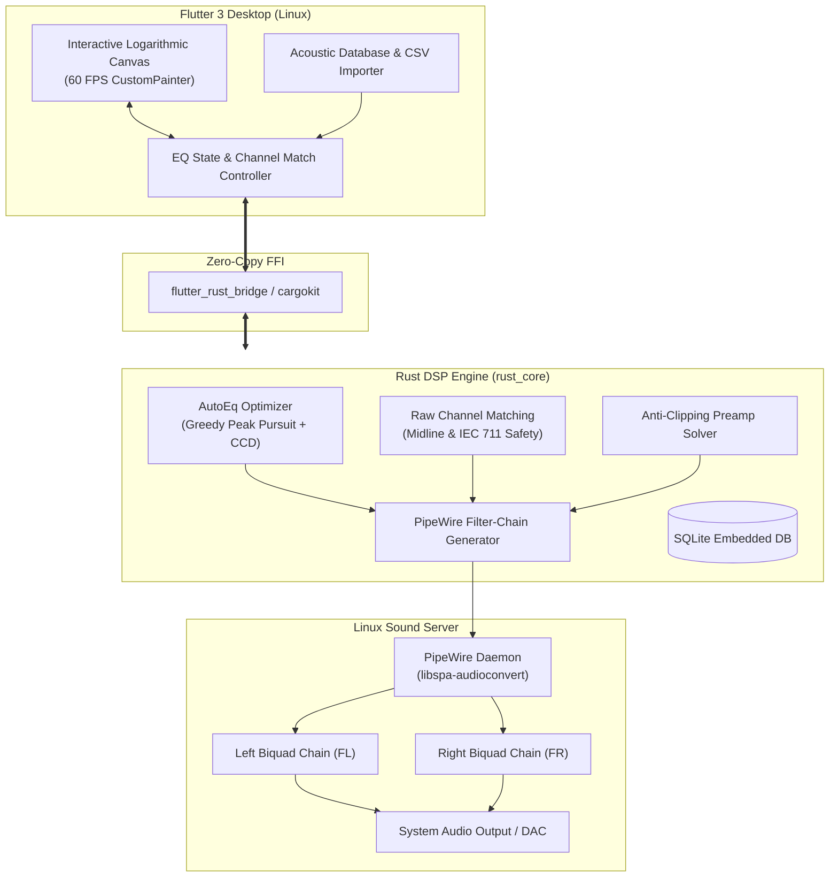

<div align="center">

# 🎧 UltEQ
### Surgical Parametric Equalizer & Acoustic Calibration Engine for Linux

[](https://www.rust-lang.org/)
[](https://flutter.dev/)
[](https://pipewire.org/)
[](https://github.com/jaakkopasanen/AutoEq)
[](LICENSE)

*An audiophile-grade, system-wide parametric equalizer and acoustic calibration workstation. Powered by a high-performance native Rust DSP core, seamless PipeWire filter-chain injection, and an obsidian Linear Dark Precision interface.*

---

</div>

## 📑 Table of Contents

- [Overview](#-overview)
- [Key Features](#-key-features)
- [Acoustic & Mathematical Principles](#-acoustic--mathematical-principles)
  - [Surgical AutoEq Optimization](#1-surgical-autoeq-optimization)
  - [Raw Channel Matching (Stereo Driver Calibration)](#2-raw-channel-matching-stereo-driver-calibration)
  - [IEC 711 Coupler Resonance Guardrails](#3-iec-711-coupler-resonance-guardrails)
  - [Dynamic Anti-Clipping Preamp](#4-dynamic-anti-clipping-preamp)
- [Crinacle Industry-Standard Acoustic Canvas](#-crinacle-industry-standard-acoustic-canvas)
- [Interactive Controls & Shortcuts](#-interactive-controls--shortcuts)
- [System Architecture](#-system-architecture)
- [Getting Started](#-getting-started)
  - [Prerequisites](#prerequisites)
  - [Building & Running](#building--running)
- [PipeWire Integration](#-pipewire-integration)
- [Acknowledgments & References](#-acknowledgments--references)
- [License](#-license)

---

## 🌟 Overview

**UltEQ** is engineered from the ground up for audiophiles, acoustic engineers, and critical listeners who demand absolute precision. Traditional graphic equalizers and naive IIR implementations often introduce phase distortion, destructive filter clustering, and clipping.

UltEQ resolves this by pairing:
1. **`rust_core`**: A native Rust digital signal processing engine that executes multi-filter peak matching pursuit, IEC 711 acoustic safety tapering, stereo driver balance calibration, and generates native PipeWire `libspa-audioconvert` filter-chains.
2. **`flutter_app`**: An obsidian-styled desktop application offering a hardware-accelerated 60 FPS logarithmic canvas, real-time cubic curve morphing, and Crinacle-standard acoustic measurement scales.

---

## ✨ Key Features

- 🎯 **Surgical AutoEq Optimization:** Calculates mathematically optimal parametric biquad filters ($f_0$, Gain, $Q$) to align any headphone measurement with industry targets (Harman, IEF Neutral, Diffuse Field) without filter overlap or clustering.
- ⚖️ **Acoustic Raw Channel Matching:** Symmetrically calibrates physical left/right earphone driver deviations to a shared acoustic midline, restoring a perfectly centered stereo soundstage without altering target EQ tonality.
- 📊 **Crinacle Standard Graph Scaling:** Toggle between standard 55 dB SPL span (50 dB sweet-spot normalized at 1 kHz for natural IEM visualization) and DAW Relative Gain mode ($\pm18$ dB / $\pm24$ dB).
- 🎛️ **Native PipeWire Filter Chains:** Generates and injects independent Left (`FL`) and Right (`FR`) biquad DSP graphs directly into PipeWire with zero virtual cables and zero latency overhead.
- 🎨 **Linear Dark Precision Aesthetic:** Tailored obsidian palette (`#0B0E14`, `#10B981`, `#38BDF8`, `#FB7185`), glassmorphic panels, and monospaced acoustic readouts.
- 📂 **Multi-Source CSV & SQLite Support:** Integrated database of thousands of headphones and target curves, alongside a flexible CSV importer supporting REW, Squiglink, and Crinacle multi-column stereo formats.
- 🛡️ **Zero-Clipping Headroom Guarantee:** Continuous transfer function evaluation ensuring the digital output never exceeds 0 dBFS.

---

## 🔬 Acoustic & Mathematical Principles

### 1. Surgical AutoEq Optimization

UltEQ computes the deviation between the normalized earphone measurement and the selected target curve across a dense logarithmic frequency grid:

$$\text{Error}(f) = Raw_{\text{norm}}(f) - Target_{\text{norm}}(f)$$

$$\text{Correction}(f) = -\text{Error}(f) = Target_{\text{norm}}(f) - Raw_{\text{norm}}(f)$$

Rather than placing filters blindly, the engine performs a **Greedy Peak Matching Pursuit** followed by **Cyclic Coordinate Descent**:
1. Locates the maximum weighted psychoacoustic residual peak/dip.
2. Initializes a biquad peaking filter with center frequency $f_0$, gain $G$, and quality factor $Q$:
   $$H(s) = \frac{s^2 + \left(\frac{A}{Q}\right) s + 1}{s^2 + \left(\frac{1}{A \cdot Q}\right) s + 1}, \quad \text{where } A = 10^{\frac{G}{40}}$$
3. Jointly refines all $K \le 10$ active filters to minimize the psychoacoustically weighted Mean Squared Error (MSE):
   $$\min_{\{f_{0k}, G_k, Q_k\}} \sum_{i} W(f_i) \left( \text{Correction}(f_i) - \sum_{k=1}^K H_k(f_i) \right)^2$$

---

### 2. Raw Channel Matching (Stereo Driver Calibration)

Physical manufacturing tolerances cause miniature IEM drivers and headphone transducers to exhibit channel imbalances. Traditional channel matching forces both channels onto a synthetic target, compounding measurement artifacts.

UltEQ introduces **Symmetric Midline Driver Matching**:
1. Computes the geometric acoustic center of the physical transducers:
   $$Raw_{\text{mid}}(f) = \frac{L(f) + R(f)}{2}$$
2. Calculates anti-symmetric corrective transfer functions for each ear:
   $$H_L(f) = Raw_{\text{mid}}(f) - L(f)$$
   $$H_R(f) = Raw_{\text{mid}}(f) - R(f) = -H_L(f)$$
3. Generates complementary twin biquads ($G_R = -G_L$) with identical center frequencies and $Q$ values. This preserves overall acoustic tonal balance while centering the stereo imaging.

---

### 3. IEC 711 Coupler Resonance Guardrails

Standard artificial ear couplers (IEC 60318-4 / IEC 711) introduce artificial half-wave resonance peaks in the 8 kHz – 10 kHz region depending on ear-tip insertion depth. Directly equalizing these artifacts causes harsh, unlistenable treble.

UltEQ applies an acoustic safety taper above 8 kHz:

$$W_{\text{match}}(f) = \begin{cases} 1.0 & f \le 8000 \text{ Hz} \\ \cos^2\left(\frac{\pi}{2} \cdot \frac{f - 8000}{20000 - 8000}\right) & f > 8000 \text{ Hz} \end{cases}$$

Gain adjustments are capped to $\pm 6\text{ dB}$, preventing unnatural compensation for acoustic measurement artifacts.

---

### 4. Dynamic Anti-Clipping Preamp

To prevent inter-sample clipping and digital overs during positive biquad boosts, UltEQ scans the combined transfer function over 500 points:

$$G_{\text{peak}} = \max\left(0.0, \, \max_{f \in [20, 20000]} \left( \sum_{k=1}^K H_k(f) \right)\right)$$

$$\text{Preamp} = \begin{cases} -(G_{\text{peak}} + \text{Headroom}) & \text{if } G_{\text{peak}} > 0 \\ 0.0\text{ dB} & \text{if } G_{\text{peak}} \le 0 \end{cases}$$

This guarantees that:
$$\forall f \in [20\text{ Hz}, 20\text{ kHz}], \quad \left(\sum_{k=1}^K H_k(f)\right) + \text{Preamp} \le -\text{Headroom} \le 0.0\text{ dBFS}$$

---

## 📊 Crinacle Industry-Standard Acoustic Canvas

Acoustic frequency response curves cannot be properly evaluated on arbitrary linear scales. UltEQ includes a dedicated **Crinacle Standard Scale Mode**:
- **Vertical Span:** Exact 55 dB SPL range (standardized across Squiglink and In-Ear Fidelity).
- **Sweet Spot:** 50 dB normalized viewing window centered around 1 kHz.
- **Logarithmic Decades:** 20 Hz, 100 Hz, 1 kHz, 10 kHz, 20 kHz with 10 dB major gridlines.
- **Dual-Channel Rendering:**
  - **Left Driver:** Electric Sky Blue (`#38BDF8`)
  - **Right Driver:** Coral Rose (`#FB7185`)
  - **Imbalance Shading:** Translucent gradient visualization highlighting driver variance.
  - **Real-Time Readout:** Live delta display ($\Delta\text{ dB}$) indicating max channel disparity.

---

## ⌨️ Interactive Controls & Shortcuts

| Action | Control / Gesture |
| :--- | :--- |
| **Add Filter** | Double-Click on the Canvas at desired frequency and gain |
| **Move Filter** | Left-Click & Drag node ($f_0$ horizontally, Gain vertically) |
| **Adjust Bandwidth (Q)** | Mouse Wheel / Scroll over selected node |
| **Convert to Low-Shelf** | Press <kbd>Q</kbd> with node selected |
| **Convert to High-Shelf** | Press <kbd>E</kbd> with node selected |
| **Delete Filter** | Press <kbd>Delete</kbd> or <kbd>Backspace</kbd> with node selected |
| **Scale Toggle** | Click `[ Crin Scale ]` / `[ DAW Scale ]` pill in canvas header |
| **Channel Match** | Click `[ ⇄ Match Channels ]` toggle chip |
| **Simulate Imbalance** | Click `[ Test Balance ]` to preview stereo correction |

---

## 🏗️ System Architecture



---

## 🚀 Getting Started

### Prerequisites

Ensure your Linux environment has the following installed:
- **Rust Toolchain:** `rustc` and `cargo` 1.75+ ([rustup.rs](https://rustup.rs/))
- **Flutter SDK:** Version 3.19+ ([flutter.dev](https://flutter.dev/docs/get-started/install/linux))
- **PipeWire:** Active sound server with `pipewire` and `pipewire-pulse`
- **Build Essentials:** `clang`, `cmake`, `pkg-config`, `libasound2-dev`

```bash
# Ubuntu / Debian
sudo apt update && sudo apt install -y clang cmake pkg-config libasound2-dev libgtk-3-dev pipewire

# Arch Linux
sudo pacman -S base-devel clang cmake pipewire
```

### Building & Running

1. **Clone the repository:**
   ```bash
   git clone https://github.com/juancollsimoes-sudo/UltEQ.git
   cd UltEQ
   ```

2. **Run the application:**
   Cargokit compiles the native Rust DSP core automatically during the Flutter build process:
   ```bash
   cd flutter_app
   flutter run -d linux
   ```

3. **Run DSP Unit Tests:**
   ```bash
   cd rust_core
   cargo test
   ```

---

## 🔊 PipeWire Integration

UltEQ generates a standalone PipeWire configuration utilizing the native `libspa-audioconvert` node:
- **Independent Stereo Processing:** Left (`FL`) and Right (`FR`) audio streams are routed through their own biquad cascade, enabling independent channel calibration and target equalization.
- **Low Overhead:** Zero inter-process audio piping or virtual loopback devices. Biquad calculations are executed directly within the PipeWire processing graph in 32-bit floating point.
- **Dynamic Reloading:** Changes applied via the UI instantly update the active filter-chain sink without breaking audio streams or requiring application restarts.

---

## 🤝 Acknowledgments & References

- **[AutoEq by jaakkopasanen](https://github.com/jaakkopasanen/AutoEq)** — Foundational work on headphone compensation algorithms and database curation.
- **[In-Ear Fidelity (Crinacle)](https://crinacle.com)** — Industry-standard acoustic measurement methodologies and graph conventions.
- **[Robert Bristow-Johnson Audio EQ Cookbook](https://www.w3.org/TR/audio-eq-cookbook/)** — Standard mathematical formulations for biquad filter transfer functions.
- **[PipeWire Project](https://pipewire.org/)** — Modern Linux multimedia routing and low-latency DSP processing.

---

## 📄 License

This project is licensed under the [MIT License](LICENSE).
